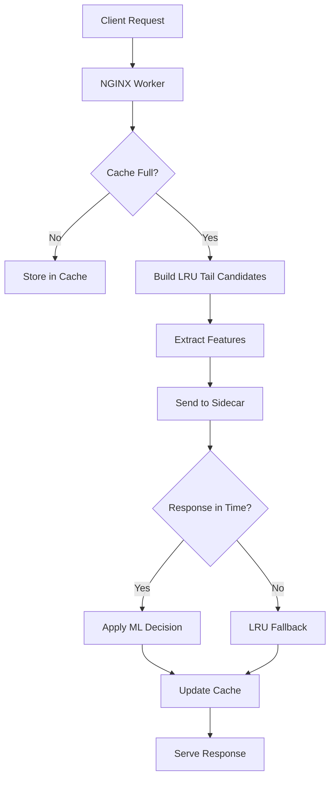
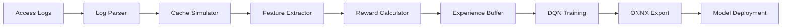

# DRL Cache Architecture

This document provides a comprehensive overview of DRL Cache's architecture, explaining how reinforcement learning is integrated with NGINX to optimize cache eviction decisions.

## Table of Contents

1. [System Overview](#system-overview)
2. [Component Architecture](#component-architecture)
3. [Data Flow](#data-flow)
4. [Machine Learning Architecture](#machine-learning-architecture)
5. [Performance Considerations](#performance-considerations)
6. [Integration Points](#integration-points)

## System Overview

DRL Cache replaces NGINX's default LRU (Least Recently Used) cache eviction with intelligent decisions made by a deep reinforcement learning model. The system learns from historical access patterns to make better eviction choices, improving cache hit ratios and reducing origin server load.

### High-Level Architecture

```
┌─────────────────┐    ┌──────────────────┐    ┌─────────────────┐
│   Client        │    │   NGINX Worker   │    │ ONNX Sidecar    │
│   Requests      │───▶│   + DRL Module   │───▶│ (Inference)     │
└─────────────────┘    └──────────────────┘    └─────────────────┘
                                │                        ▲
                                ▼                        │
                       ┌──────────────────┐             │
                       │  Cache Storage   │             │
                       │  (Disk/Memory)   │             │
                       └──────────────────┘             │
                                                        │
                       ┌──────────────────┐             │
                       │  Access Logs     │             │
                       │  (Training Data) │             │
                       └──────────────────┘             │
                                │                        │
                                ▼                        │
                       ┌──────────────────┐             │
                       │  Training        │             │
                       │  Pipeline        │─────────────┘
                       │  (PyTorch)       │
                       └──────────────────┘
```

### Key Design Principles

1. **Drop-in Compatibility**: Works with existing NGINX configurations
2. **Fault Tolerance**: Falls back to LRU if ML inference fails
3. **Low Latency**: Inference completes in <500μs or falls back
4. **Self-Improving**: Continuously learns from new access patterns
5. **Production-Ready**: Designed for high-traffic environments

## Component Architecture

### 1. NGINX Dynamic Module (`ngx_http_drl_cache_module`)

The NGINX module is written in C and integrates directly with NGINX's cache management system.

#### Key Files:
- `ngx_http_drl_cache_module.c` - Main module logic and configuration
- `drl_cache_features.c` - Feature extraction from cache objects
- `drl_cache_ipc.c` - Communication with ONNX sidecar

#### Responsibilities:
- **Hook Cache Eviction**: Intercepts NGINX's cache eviction process
- **Feature Extraction**: Builds feature vectors for cache candidates
- **IPC Communication**: Sends features to sidecar and receives decisions
- **Fallback Management**: Ensures system reliability with LRU fallback
- **Configuration Management**: Handles all DRL Cache directives

#### Configuration Directives:

```nginx
drl_cache on;                          # Enable/disable DRL Cache
drl_cache_k 16;                        # Number of LRU tail candidates
drl_cache_socket /path/to/socket;      # Sidecar communication socket
drl_cache_timeout 500us;               # Maximum inference time
drl_cache_fallback lru;                # Fallback strategy
drl_cache_shadow on;                   # Shadow mode (log only)
drl_cache_min_free 512m;               # Minimum free space buffer
```

### 2. ONNX Inference Sidecar

A lightweight C++ service that runs machine learning inference using ONNX Runtime.

#### Key Components:
- `DRLCacheModel` - ONNX model wrapper with hot-swapping
- `SidecarServer` - Unix domain socket server
- `SignalHandler` - Graceful shutdown and model reloading

#### Responsibilities:
- **Model Loading**: Loads and validates ONNX models
- **Inference Execution**: Runs neural network inference
- **Hot Model Swapping**: Updates models without downtime
- **Performance Monitoring**: Tracks inference latency and success rates
- **Resource Management**: Efficient memory and CPU usage

#### IPC Protocol:

```c
// Request message
struct DRLCacheIPCRequest {
    uint32_t version;        // Protocol version
    uint16_t k;             // Number of candidates
    uint16_t feature_dims;  // Features per candidate (6)
    float features[K * 6];  // Feature matrix (row-major)
};

// Response message  
struct DRLCacheIPCResponse {
    uint32_t eviction_mask; // Bitmask: 1=evict, 0=keep
};
```

### 3. Training Pipeline

A comprehensive PyTorch-based system for training the cache eviction policy.

#### Key Modules:
- `data_pipeline.py` - Access log parsing and cache simulation
- `model.py` - Dueling DQN neural network architecture
- `train.py` - Main training loop with experience replay
- `reward_calculator.py` - Reward function for reinforcement learning

#### Training Architecture:

```
Access Logs ──▶ ETL ──▶ Cache Simulator ──▶ Experience Buffer
                                                    │
                                                    ▼
ONNX Model ◀── Export ◀── Training Loop ◀── Dueling DQN
```

## Data Flow

### 1. Runtime Inference Flow



### 2. Training Data Flow



### 3. Feature Engineering

For each cache candidate, the system extracts 6 features:

| Feature | Description | Units | Example |
|---------|-------------|-------|---------|
| `age_sec` | Time since object creation | seconds | 3600 |
| `size_kb` | Object size (log-scaled) | log(KB) | 4.6 |
| `hit_count` | Number of cache hits | count | 15 |
| `inter_arrival_dt` | Time since last access | seconds | 300 |
| `ttl_left_sec` | Remaining time to live | seconds | 1800 |
| `last_origin_rtt_us` | Last upstream response time | microseconds | 150000 |

Features are normalized using running statistics:
```python
normalized_feature = (feature - running_mean) / running_std
clipped_feature = clip(normalized_feature, -5σ, +5σ)
```

## Machine Learning Architecture

### 1. Dueling Deep Q-Network (DQN)

The core ML model is a Dueling DQN that separates value and advantage functions:

```
Input: Features[K×6] → Flatten[K×6] → Shared Layers[256]
                                            │
                                            ├─▶ Value Stream[128] ──▶ V(s)[1]
                                            │
                                            └─▶ Advantage Stream[128] ──▶ A(s,a)[K]

Q(s,a) = V(s) + A(s,a) - mean(A(s,·))
```

#### Network Architecture:
```python
class DuelingDQN(nn.Module):
    def __init__(self):
        # Shared feature extraction
        self.shared = nn.Sequential(
            nn.Linear(K*6, 256),
            nn.LayerNorm(256),
            nn.ReLU(),
            nn.Dropout(0.1),
            nn.Linear(256, 256),
            nn.LayerNorm(256),
            nn.ReLU()
        )
        
        # Value stream: V(s)
        self.value = nn.Sequential(
            nn.Linear(256, 128),
            nn.ReLU(),
            nn.Linear(128, 1)
        )
        
        # Advantage stream: A(s,a)  
        self.advantage = nn.Sequential(
            nn.Linear(256, 128),
            nn.ReLU(),
            nn.Linear(128, K)
        )
```

### 2. Training Algorithm

The system uses **Prioritized Experience Replay** with the following components:

#### Experience Replay Buffer:
- **Capacity**: 2M transitions
- **Prioritization**: TD-error based sampling
- **Importance Sampling**: Corrects for bias in prioritized sampling

#### Training Loop:
```python
for epoch in range(num_epochs):
    for step in range(steps_per_epoch):
        # Sample prioritized batch
        states, actions, rewards, next_states, weights, indices = replay_buffer.sample()
        
        # Compute Q-values
        current_q = model(states)
        target_q = target_model(next_states).detach()
        
        # Bellman equation
        targets = rewards + gamma * target_q.max(1)[0]
        
        # Compute loss with importance sampling
        td_errors = targets - current_q.gather(1, actions)
        loss = (weights * td_errors.pow(2)).mean()
        
        # Update model
        optimizer.zero_grad()
        loss.backward()
        optimizer.step()
        
        # Update priorities
        replay_buffer.update_priorities(indices, td_errors.abs())
        
        # Soft update target network
        soft_update(target_model, model, tau=0.005)
```

### 3. Reward Function

The reward function encourages keeping objects that will be accessed again:

```python
def compute_reward(candidate, action, future_accesses):
    base_reward = 0
    
    if action == KEEP:
        if candidate.key in future_accesses:
            base_reward = +1.0  # Reward for correct keep
        else:
            base_reward = -0.1  # Penalty for incorrect keep
    else:  # EVICT
        if candidate.key in future_accesses:
            base_reward = -1.0  # Penalty for incorrect eviction
        else:
            base_reward = +0.1  # Small reward for correct eviction
    
    # Size penalty (prevent hoarding large objects)
    if action == KEEP:
        size_penalty = 0.05 * (candidate.size_mb)
        base_reward -= size_penalty
    
    return base_reward
```

## Performance Considerations

### 1. Latency Requirements

The system is designed for microsecond-scale inference:

| Component | Target Latency | Typical Latency |
|-----------|----------------|-----------------|
| Feature extraction | <50μs | ~20μs |
| IPC communication | <100μs | ~50μs |
| ONNX inference | <300μs | ~150μs |
| **Total** | **<500μs** | **~220μs** |

### 2. Memory Usage

| Component | Memory Usage | Notes |
|-----------|--------------|--------|
| NGINX module | <1MB | Minimal overhead |
| ONNX sidecar | ~50MB | Model + runtime |
| ONNX model | <8KB | Quantized int8 |
| Feature buffer | ~3KB | K×6×4 bytes |

### 3. CPU Overhead

- **NGINX workers**: <1% additional CPU per worker
- **Sidecar process**: ~2% of one CPU core
- **Total system overhead**: <2% on typical 8-core server

### 4. Scalability

- **Horizontal**: Each NGINX worker has its own sidecar connection
- **Vertical**: Linear scaling with number of eviction decisions
- **Model updates**: Hot-swapping without service interruption
- **Training**: Can run offline on separate infrastructure

## Integration Points

### 1. NGINX Integration

The module hooks into NGINX's cache eviction at the `ngx_http_file_cache_forced_expire` level:

```c
// Original NGINX function
ngx_int_t ngx_http_file_cache_forced_expire(ngx_http_cache_t *c) {
    // Standard LRU eviction
}

// DRL Cache hook
ngx_int_t drl_cache_forced_expire(ngx_http_request_t *r, 
                                 ngx_http_cache_t *c, 
                                 size_t bytes_needed) {
    // 1. Build candidate list from LRU tail
    // 2. Extract features
    // 3. Get ML decision with timeout
    // 4. Apply eviction or fallback to LRU
}
```

### 2. Monitoring Integration

The system exposes metrics compatible with standard monitoring tools:

#### Prometheus Metrics:
```
# Inference performance
drl_cache_inference_duration_seconds{quantile="0.5"} 0.000150
drl_cache_inference_duration_seconds{quantile="0.95"} 0.000450

# Cache performance
drl_cache_hit_ratio 0.85
drl_cache_fallback_rate 0.02

# System health
drl_cache_model_reload_total 5
drl_cache_errors_total 12
```

#### Log Formats:
```
# NGINX access log with cache status
$remote_addr - [$time_local] "$request" $status $body_bytes_sent 
"$upstream_cache_status" "$drl_cache_fallback" $upstream_response_time

# Sidecar structured logs
{"timestamp": "2024-01-15T10:30:45Z", "level": "INFO", 
 "inference_time_us": 180, "decision_mask": "0x00001101"}
```

### 3. Deployment Integration

#### Docker Support:
```dockerfile
# Multi-stage build for minimal production image
FROM nginx:1.24 as production
COPY --from=builder /etc/nginx/modules/ngx_http_drl_cache_module.so /etc/nginx/modules/
COPY --from=builder /usr/local/bin/drl-cache-sidecar /usr/local/bin/
COPY config/nginx.conf /etc/nginx/nginx.conf
COPY models/policy.onnx /opt/drl-cache/models/
```

#### Kubernetes Deployment:
```yaml
apiVersion: apps/v1
kind: Deployment
metadata:
  name: nginx-drl-cache
spec:
  template:
    spec:
      containers:
      - name: nginx
        image: nginx-drl-cache:latest
        ports:
        - containerPort: 80
      - name: drl-sidecar
        image: drl-cache-sidecar:latest
        command: ["/usr/local/bin/drl-cache-sidecar"]
        args: ["--socket", "/tmp/drl-cache.sock"]
        volumeMounts:
        - name: socket-vol
          mountPath: /tmp
      volumes:
      - name: socket-vol
        emptyDir: {}
```

## Future Enhancements

### 1. Multi-Objective Optimization
- **Objective**: Optimize for both hit ratio and latency
- **Implementation**: Multi-head network with weighted objectives
- **Timeline**: Next major version

### 2. Federated Learning
- **Objective**: Learn from multiple cache instances
- **Implementation**: Gradient sharing between instances
- **Benefits**: Better generalization across traffic patterns

### 3. Online Learning
- **Objective**: Real-time model updates
- **Implementation**: Incremental learning with experience replay
- **Benefits**: Faster adaptation to traffic changes

### 4. Advanced Features
- **Content-Aware Caching**: Include URL/content type features
- **Geographic Optimization**: Location-aware cache decisions  
- **Time-Series Modeling**: Better prediction of access patterns

## Conclusion

DRL Cache represents a significant advancement in web cache optimization, combining the reliability of traditional systems with the intelligence of modern machine learning. The architecture is designed for production use while maintaining the flexibility needed for continuous improvement and adaptation to changing traffic patterns.
