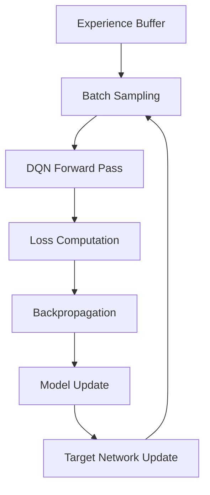
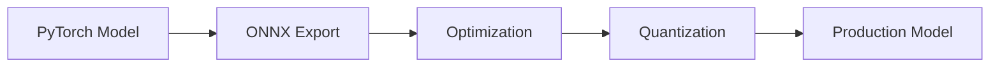

# DRL Cache Training Guide

This guide provides detailed information about training cache eviction policies using deep reinforcement learning, from basic concepts to advanced optimization techniques.

## Table of Contents

1. [Understanding the Problem](#understanding-the-problem)
2. [Training Workflow](#training-workflow)
3. [Data Preparation](#data-preparation)
4. [Model Architecture](#model-architecture)
5. [Training Configuration](#training-configuration)
6. [Advanced Techniques](#advanced-techniques)
7. [Model Evaluation](#model-evaluation)
8. [Production Deployment](#production-deployment)

## Understanding the Problem

### Cache Eviction as Reinforcement Learning

DRL Cache frames cache eviction as a **multi-armed bandit** problem where:

- **State**: Features of K cache candidates (age, size, hit count, etc.)
- **Actions**: Binary decisions for each candidate (evict or keep)
- **Reward**: Future cache hits minus penalties for poor decisions
- **Goal**: Maximize long-term cache hit ratio and minimize origin load

### Why Deep Q-Networks (DQN)?

Traditional cache eviction policies like LRU use simple heuristics. DQN can:

1. **Learn complex patterns** from historical access data
2. **Consider multiple features** simultaneously (size, recency, frequency)
3. **Adapt to workload changes** through continuous learning
4. **Balance trade-offs** between hit ratio and resource usage

### The Dueling DQN Architecture

We use **Dueling DQN** to separate:
- **Value function V(s)**: How good is this cache state overall?
- **Advantage function A(s,a)**: How much better is action a compared to average?

This separation improves learning stability when many actions have similar values.

## Training Workflow

### 1. Data Collection Phase


**Duration**: Collect 1-7 days of representative traffic
**Output**: Parsed cache events with features and outcomes

### 2. Training Phase



**Duration**: 2-12 hours depending on data size and hardware
**Output**: Trained PyTorch model

### 3. Export Phase



**Duration**: Few minutes
**Output**: Optimized ONNX model for inference

## Data Preparation

### Log Format Requirements

Your NGINX access logs must include cache status information:

```nginx
log_format cache_combined '$remote_addr - $remote_user [$time_local] '
                         '"$request" $status $body_bytes_sent '
                         '"$http_referer" "$http_user_agent" '
                         '"$upstream_cache_status" "$cache_key" '
                         '"$upstream_response_time" "$cache_ttl"';
```

**Required Fields:**
- `$upstream_cache_status`: HIT, MISS, BYPASS, EXPIRED, etc.
- `$cache_key`: Unique identifier for cached object
- `$upstream_response_time`: Origin server response time
- `$cache_ttl`: Time-to-live for the object

### Data Quality Checks

Before training, verify your data quality:

```python
# Run data quality analysis
from training.src.data_pipeline import DataPipeline
from training.src.config import DataConfig, FeatureConfig

pipeline = DataPipeline(DataConfig(), FeatureConfig())

# Analyze log file
stats = pipeline.analyze_logs("/var/log/nginx/access.log")
print(f"Total requests: {stats['total_requests']}")
print(f"Cache hit ratio: {stats['hit_ratio']:.2%}")
print(f"Unique cache keys: {stats['unique_keys']}")
print(f"Time span: {stats['time_span']}")
```

**Quality Criteria:**
- **Hit ratio**: 30-90% (too low/high indicates configuration issues)
- **Unique objects**: 1000+ distinct cache keys
- **Time span**: At least 24 hours for daily patterns
- **Request volume**: 10k+ requests for statistical significance

### Feature Engineering

The system extracts 6 features per cache candidate:

```python
def extract_features(cache_object, current_time):
    return [
        (current_time - cache_object.created_at).total_seconds(),  # age_sec
        np.log1p(cache_object.size_bytes / 1024),                 # size_kb (log-scaled)
        cache_object.hit_count,                                   # hit_count
        (current_time - cache_object.last_access).total_seconds(), # inter_arrival_dt
        max(0, cache_object.ttl - age_seconds),                   # ttl_left_sec
        cache_object.avg_upstream_time_us,                        # last_origin_rtt_us
    ]
```

**Feature Normalization:**
```python
# Running statistics for online normalization
normalized_feature = (feature - running_mean) / running_std
clipped_feature = np.clip(normalized_feature, -5, 5)  # Outlier clipping
```

## Model Architecture

### Dueling DQN Structure

```python
class DuelingDQN(nn.Module):
    def __init__(self, input_dim=6, max_k=32, hidden_dim=256):
        super().__init__()
        
        # Shared feature extraction
        self.shared_layers = nn.Sequential(
            nn.Linear(input_dim * max_k, hidden_dim),
            nn.LayerNorm(hidden_dim),
            nn.ReLU(),
            nn.Dropout(0.1),
            nn.Linear(hidden_dim, hidden_dim),
            nn.LayerNorm(hidden_dim),
            nn.ReLU(),
        )
        
        # Value stream: V(s) - single output
        self.value_head = nn.Sequential(
            nn.Linear(hidden_dim, 128),
            nn.ReLU(),
            nn.Linear(128, 1)
        )
        
        # Advantage stream: A(s,a) - one output per candidate
        self.advantage_head = nn.Sequential(
            nn.Linear(hidden_dim, 128),
            nn.ReLU(),
            nn.Linear(128, max_k)
        )
    
    def forward(self, x, candidate_mask=None):
        shared = self.shared_layers(x)
        
        value = self.value_head(shared)  # V(s)
        advantage = self.advantage_head(shared)  # A(s,a)
        
        # Dueling combination: Q(s,a) = V(s) + A(s,a) - mean(A(s,·))
        if candidate_mask is not None:
            # Mask invalid candidates
            advantage = advantage.masked_fill(~candidate_mask, -1e8)
            advantage_mean = advantage.sum(dim=1, keepdim=True) / candidate_mask.sum(dim=1, keepdim=True)
        else:
            advantage_mean = advantage.mean(dim=1, keepdim=True)
        
        q_values = value + advantage - advantage_mean
        
        if candidate_mask is not None:
            q_values = q_values.masked_fill(~candidate_mask, -1e8)
        
        return q_values
```

### Architecture Choices Explained

1. **Layer Normalization**: More stable than Batch Norm for RL
2. **Dropout**: Prevents overfitting on historical patterns
3. **ReLU Activation**: Simple and effective for this domain
4. **Dueling Heads**: Separates state value from action advantages

### Model Size Considerations

```python
# Calculate model parameters
def count_parameters(model):
    return sum(p.numel() for p in model.parameters() if p.requires_grad)

# Typical model sizes:
# Small (K=16, hidden=128): ~50K parameters, ~200KB ONNX
# Medium (K=32, hidden=256): ~200K parameters, ~800KB ONNX  
# Large (K=32, hidden=512): ~800K parameters, ~3MB ONNX
```

**Production Constraints:**
- **Inference time**: <500μs (favors smaller models)
- **Memory usage**: <10MB (int8 quantization helps)
- **Model complexity**: Balance accuracy vs. speed

## Training Configuration

### Basic Configuration

```yaml
# config/training.yaml
model:
  input_dim: 6
  max_k: 32
  hidden_dim: 256
  
training:
  learning_rate: 3.0e-4
  batch_size: 4096
  num_epochs: 100
  gamma: 0.97  # Discount factor
  
replay:
  capacity: 2000000  # 2M transitions
  prioritized: true
  alpha: 0.6  # Prioritization strength
```

### Hyperparameter Tuning

#### Learning Rate Schedule
```python
# Cosine annealing with warmup
def get_lr_schedule(optimizer, warmup_steps, max_steps):
    def lr_lambda(step):
        if step < warmup_steps:
            return step / warmup_steps
        progress = (step - warmup_steps) / (max_steps - warmup_steps)
        return 0.5 * (1 + np.cos(np.pi * progress))
    
    return torch.optim.lr_scheduler.LambdaLR(optimizer, lr_lambda)
```

#### Replay Buffer Settings
```python
# Prioritized Experience Replay
class PrioritizedReplayBuffer:
    def __init__(self, capacity, alpha=0.6, beta=0.4):
        self.alpha = alpha      # Prioritization strength (0=uniform, 1=fully prioritized)
        self.beta = beta        # Importance sampling correction
        self.beta_increment = (1.0 - beta) / 100000  # Anneal beta over training
```

### Reward Function Design

The reward function is crucial for learning good cache policies:

```python
def compute_reward(candidate, action, future_accesses, config):
    """
    Compute reward for cache decision
    
    Args:
        candidate: Cache object candidate
        action: KEEP (0) or EVICT (1)
        future_accesses: List of future access times for this object
        config: Reward configuration
    
    Returns:
        reward: Float reward value
    """
    base_reward = 0
    
    # Primary reward: based on future cache hits
    hits_within_ttl = count_hits_before_expiry(candidate, future_accesses)
    
    if action == KEEP:
        if hits_within_ttl > 0:
            base_reward = config.hit_reward * hits_within_ttl  # Reward for correct keep
        else:
            base_reward = -config.miss_penalty  # Penalty for unnecessary keep
    else:  # EVICT
        if hits_within_ttl > 0:
            base_reward = -config.hit_reward * hits_within_ttl  # Penalty for bad eviction
        else:
            base_reward = 0.1 * config.hit_reward  # Small reward for good eviction
    
    # Size penalty: discourage keeping large objects
    if action == KEEP and config.use_size_penalty:
        size_mb = candidate.size_bytes / (1024 * 1024)
        size_penalty = config.size_penalty_lambda * size_mb
        base_reward -= size_penalty
    
    # Frequency bonus: reward keeping frequently accessed objects
    if action == KEEP and config.use_frequency_bonus:
        frequency_bonus = config.frequency_bonus_scale * np.log1p(candidate.hit_count)
        base_reward += frequency_bonus
    
    return base_reward
```

### Training Loop Implementation

```python
def train_epoch(model, replay_buffer, optimizer, config):
    model.train()
    epoch_losses = []
    
    for step in range(config.training.steps_per_epoch):
        # Sample prioritized batch
        batch = replay_buffer.sample(config.training.batch_size)
        if batch is None:
            continue
            
        states, actions, rewards, next_states, dones, weights, indices = batch
        
        # Current Q-values
        current_q_values = model(states)
        current_q_values = current_q_values.gather(1, actions.unsqueeze(1)).squeeze(1)
        
        # Target Q-values (with target network)
        with torch.no_grad():
            next_q_values = target_model(next_states)
            max_next_q_values = next_q_values.max(1)[0]
            target_q_values = rewards + config.training.gamma * max_next_q_values * (1 - dones)
        
        # Compute TD errors
        td_errors = target_q_values - current_q_values
        
        # Prioritized replay loss (weighted by importance sampling)
        loss = (weights * td_errors.pow(2)).mean()
        
        # Optimize
        optimizer.zero_grad()
        loss.backward()
        torch.nn.utils.clip_grad_norm_(model.parameters(), config.training.grad_clip_norm)
        optimizer.step()
        
        # Update priorities
        priorities = td_errors.abs().cpu().numpy()
        replay_buffer.update_priorities(indices, priorities)
        
        epoch_losses.append(loss.item())
    
    return np.mean(epoch_losses)
```

## Advanced Techniques

### 1. Curriculum Learning

Start with simple scenarios and gradually increase complexity:

```python
def curriculum_schedule(epoch, total_epochs):
    """
    Gradually increase training complexity
    """
    progress = epoch / total_epochs
    
    # Start with small K, increase over time
    k_candidates = int(8 + 24 * progress)  # 8 → 32
    
    # Start with shorter prediction horizon
    prediction_horizon = int(3600 + 7200 * progress)  # 1h → 3h
    
    # Increase noise to improve robustness
    feature_noise = 0.01 + 0.05 * progress  # 1% → 6%
    
    return k_candidates, prediction_horizon, feature_noise
```

### 2. Multi-Objective Optimization

Optimize for both hit ratio and latency:

```python
class MultiObjectiveDQN(DuelingDQN):
    def __init__(self, *args, **kwargs):
        super().__init__(*args, **kwargs)
        
        # Additional head for latency prediction
        self.latency_head = nn.Sequential(
            nn.Linear(self.hidden_dim, 64),
            nn.ReLU(),
            nn.Linear(64, 1)
        )
    
    def forward(self, x, candidate_mask=None):
        shared = self.shared_layers(x)
        
        # Q-values for cache decisions
        q_values = super().forward_from_shared(shared, candidate_mask)
        
        # Latency prediction
        latency_pred = self.latency_head(shared)
        
        return q_values, latency_pred

def multi_objective_loss(q_values, target_q, latency_pred, target_latency, alpha=0.8):
    """
    Combined loss for cache performance and latency
    """
    cache_loss = F.mse_loss(q_values, target_q)
    latency_loss = F.mse_loss(latency_pred, target_latency)
    
    return alpha * cache_loss + (1 - alpha) * latency_loss
```

### 3. Online Learning

Implement incremental learning for production adaptation:

```python
class OnlineDQN:
    def __init__(self, model, optimizer, replay_buffer):
        self.model = model
        self.optimizer = optimizer
        self.replay_buffer = replay_buffer
        self.update_frequency = 1000  # Update every N requests
        
    def add_experience(self, state, action, reward, next_state, done):
        """Add new experience and potentially trigger update"""
        self.replay_buffer.add(state, action, reward, next_state, done)
        
        if len(self.replay_buffer) % self.update_frequency == 0:
            self.incremental_update()
    
    def incremental_update(self, n_updates=10):
        """Perform small number of gradient updates"""
        for _ in range(n_updates):
            batch = self.replay_buffer.sample(256)  # Smaller batch size
            if batch is not None:
                loss = self.compute_loss(batch)
                
                self.optimizer.zero_grad()
                loss.backward()
                self.optimizer.step()
```

### 4. Domain Adaptation

Adapt models trained on one workload to another:

```python
def fine_tune_model(pretrained_model, new_data, config):
    """
    Fine-tune a pre-trained model on new data
    """
    # Freeze early layers, only train later layers
    for param in pretrained_model.shared_layers[:2].parameters():
        param.requires_grad = False
    
    # Use lower learning rate for fine-tuning
    optimizer = torch.optim.Adam(
        filter(lambda p: p.requires_grad, pretrained_model.parameters()),
        lr=config.training.learning_rate * 0.1
    )
    
    # Train for fewer epochs
    fine_tune_config = config.copy()
    fine_tune_config.training.num_epochs = 20
    
    return train_model(pretrained_model, new_data, fine_tune_config, optimizer)
```

## Model Evaluation

### Offline Evaluation Metrics

1. **Hit Ratio Improvement**
   ```python
   def evaluate_hit_ratio(model, test_data):
       drl_hits = 0
       lru_hits = 0
       total_requests = 0
       
       for episode in test_data:
           drl_decisions = model.predict(episode.features)
           lru_decisions = lru_baseline(episode.candidates)
           
           drl_hits += count_future_hits(episode, drl_decisions)
           lru_hits += count_future_hits(episode, lru_decisions)
           total_requests += len(episode)
       
       drl_hit_ratio = drl_hits / total_requests
       lru_hit_ratio = lru_hits / total_requests
       
       return drl_hit_ratio - lru_hit_ratio  # Improvement
   ```

2. **Byte Hit Ratio**
   ```python
   def evaluate_byte_hit_ratio(model, test_data):
       """Weight hits by object size"""
       drl_byte_hits = 0
       total_bytes = 0
       
       for episode in test_data:
           decisions = model.predict(episode.features)
           for i, candidate in enumerate(episode.candidates):
               if decisions[i] == KEEP:
                   future_hits = count_future_hits(candidate)
                   drl_byte_hits += candidate.size * future_hits
               total_bytes += candidate.size
       
       return drl_byte_hits / total_bytes
   ```

3. **Origin Offload**
   ```python
   def evaluate_origin_offload(model, test_data):
       """Measure reduction in origin server requests"""
       baseline_misses = simulate_cache_misses(test_data, lru_policy)
       drl_misses = simulate_cache_misses(test_data, model)
       
       return (baseline_misses - drl_misses) / baseline_misses
   ```

### Online A/B Testing

Deploy models safely using shadow mode and gradual rollout:

```python
class ABTestManager:
    def __init__(self, control_policy, test_policy, test_ratio=0.1):
        self.control_policy = control_policy  # LRU
        self.test_policy = test_policy        # DRL
        self.test_ratio = test_ratio
        self.metrics = {
            'control': {'hits': 0, 'misses': 0},
            'test': {'hits': 0, 'misses': 0}
        }
    
    def get_policy(self, request_hash):
        """Deterministically assign requests to control/test"""
        if hash(request_hash) % 100 < self.test_ratio * 100:
            return 'test', self.test_policy
        else:
            return 'control', self.control_policy
    
    def record_outcome(self, group, hit):
        """Record cache hit/miss for analysis"""
        if hit:
            self.metrics[group]['hits'] += 1
        else:
            self.metrics[group]['misses'] += 1
    
    def get_results(self):
        """Calculate statistical significance of results"""
        control_hr = self.metrics['control']['hits'] / (
            self.metrics['control']['hits'] + self.metrics['control']['misses']
        )
        test_hr = self.metrics['test']['hits'] / (
            self.metrics['test']['hits'] + self.metrics['test']['misses']
        )
        
        # Chi-square test for significance
        from scipy.stats import chi2_contingency
        contingency_table = [
            [self.metrics['control']['hits'], self.metrics['control']['misses']],
            [self.metrics['test']['hits'], self.metrics['test']['misses']]
        ]
        chi2, p_value, _, _ = chi2_contingency(contingency_table)
        
        return {
            'control_hit_ratio': control_hr,
            'test_hit_ratio': test_hr,
            'improvement': test_hr - control_hr,
            'p_value': p_value,
            'significant': p_value < 0.05
        }
```

## Production Deployment

### Model Export Pipeline

```python
def export_production_model(pytorch_model, config):
    """Export PyTorch model to optimized ONNX for production"""
    
    # Set to eval mode
    pytorch_model.eval()
    
    # Create dummy input matching production format
    batch_size = 1
    input_size = config.model.max_k * config.model.input_dim
    dummy_input = torch.randn(batch_size, input_size)
    
    # Export to ONNX
    torch.onnx.export(
        pytorch_model,
        dummy_input,
        "policy.onnx",
        export_params=True,
        opset_version=config.export.onnx_opset_version,
        do_constant_folding=True,
        input_names=['input'],
        output_names=['output'],
        dynamic_axes={
            'input': {0: 'batch_size'},
            'output': {0: 'batch_size'}
        }
    )
    
    # Optimize ONNX model
    if config.export.optimize_model:
        import onnxoptimizer
        onnx_model = onnx.load("policy.onnx")
        optimized_model = onnxoptimizer.optimize(onnx_model)
        onnx.save(optimized_model, "policy_optimized.onnx")
    
    # Quantize to INT8 for faster inference
    if config.export.quantize_int8:
        from onnxruntime.quantization import quantize_dynamic, QuantType
        quantize_dynamic(
            "policy_optimized.onnx", 
            "policy_quantized.onnx",
            weight_type=QuantType.QInt8
        )
    
    return "policy_quantized.onnx"

def validate_exported_model(onnx_path, pytorch_model, test_input):
    """Verify ONNX model produces same outputs as PyTorch"""
    import onnxruntime as ort
    
    # PyTorch inference
    with torch.no_grad():
        pytorch_output = pytorch_model(test_input).numpy()
    
    # ONNX inference
    ort_session = ort.InferenceSession(onnx_path)
    onnx_output = ort_session.run(None, {'input': test_input.numpy()})[0]
    
    # Check outputs match within tolerance
    max_diff = np.max(np.abs(pytorch_output - onnx_output))
    assert max_diff < 1e-4, f"Model outputs differ by {max_diff}"
    
    print(f"✓ Model validation passed (max_diff: {max_diff:.2e})")
```

### Automated Retraining Pipeline

```python
def setup_automated_retraining():
    """Set up automated model retraining pipeline"""
    
    # Check if retraining is needed
    def should_retrain():
        # Check model age
        model_age = time.time() - os.path.getmtime('/opt/drl-cache/models/policy.onnx')
        if model_age > 7 * 24 * 3600:  # 7 days
            return True
        
        # Check performance degradation
        recent_hit_ratio = get_recent_hit_ratio(hours=24)
        baseline_hit_ratio = get_baseline_hit_ratio()
        if recent_hit_ratio < baseline_hit_ratio - 0.05:  # 5pp drop
            return True
        
        return False
    
    # Retraining workflow
    def retrain_model():
        try:
            # Extract recent training data
            log_path = '/var/log/nginx/access.log'
            
            # Train new model
            subprocess.run([
                'python', '/opt/drl-cache/training/src/train.py',
                '--log-path', log_path,
                '--output-dir', '/tmp/retrain',
                '--config', '/opt/drl-cache/training/config/training.yaml'
            ], check=True)
            
            # Validate new model
            new_model_path = '/tmp/retrain/models/policy.onnx'
            if validate_new_model(new_model_path):
                # Deploy new model
                shutil.copy(new_model_path, '/opt/drl-cache/models/policy.onnx')
                
                # Signal sidecar to reload
                subprocess.run(['systemctl', 'reload', 'drl-cache-sidecar'])
                
                log_info("Model retrained and deployed successfully")
            else:
                log_error("New model validation failed, keeping old model")
                
        except Exception as e:
            log_error(f"Retraining failed: {e}")
    
    # Schedule retraining check
    import schedule
    schedule.every().day.at("02:00").do(lambda: retrain_model() if should_retrain() else None)
```

### Monitoring in Production

```python
def setup_production_monitoring():
    """Set up comprehensive monitoring for production deployment"""
    
    # Metrics to track
    metrics = {
        'hit_ratio': {'target': '>80%', 'alert_threshold': '<70%'},
        'inference_latency_p95': {'target': '<500μs', 'alert_threshold': '>1000μs'},
        'fallback_rate': {'target': '<5%', 'alert_threshold': '>15%'},
        'model_accuracy': {'target': '>90%', 'alert_threshold': '<80%'},
    }
    
    # Alert rules
    def check_alerts():
        current_metrics = collect_metrics()
        
        for metric, thresholds in metrics.items():
            if current_metrics[metric] < parse_threshold(thresholds['alert_threshold']):
                send_alert(f"DRL Cache {metric} below threshold: {current_metrics[metric]}")
    
    # Dashboard configuration
    dashboard_config = {
        'panels': [
            {'title': 'Hit Ratio Over Time', 'type': 'timeseries', 'metric': 'hit_ratio'},
            {'title': 'Inference Latency', 'type': 'histogram', 'metric': 'latency_histogram'},
            {'title': 'Model Performance', 'type': 'gauge', 'metric': 'model_accuracy'},
            {'title': 'System Health', 'type': 'status', 'metric': 'service_status'},
        ]
    }
    
    return dashboard_config
```

This comprehensive training guide provides everything needed to successfully train and deploy DRL Cache models in production environments. The key to success is starting with good data, using appropriate model architectures, and implementing robust evaluation and deployment pipelines.
